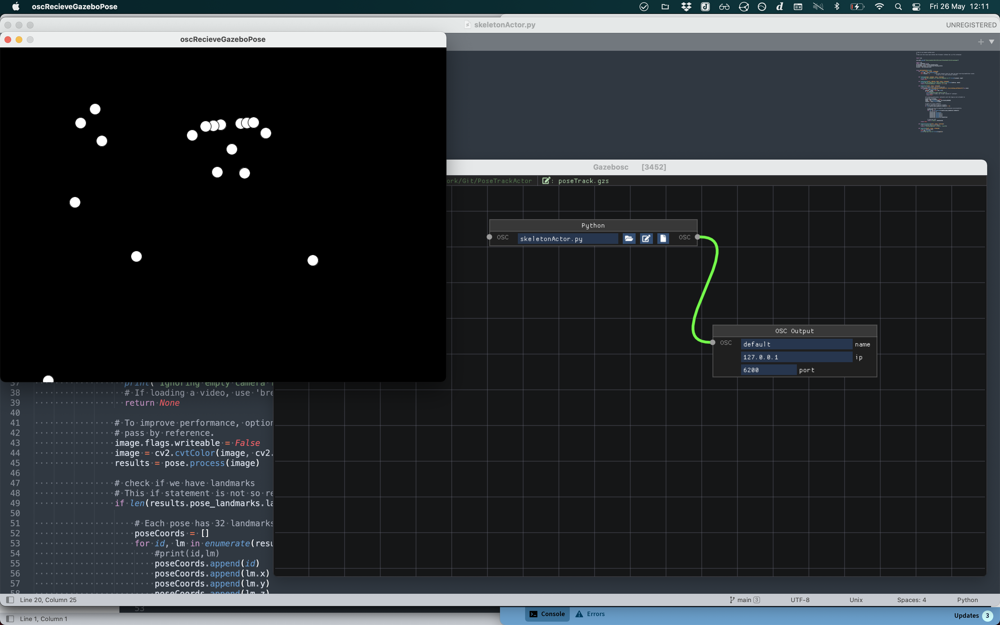

# GazeboOsc Mediapipe Python actors

This repo contains Gazebosc Python actors you can run from Gazebosc to use Mediapipe functionlaity such as:  
- pose tracking 
- face tracking

### Mediapipe
This actor uses the [mediapipe library](https://developers.google.com/mediapipe) So you need to refrence to where this library is installed on your system. We advise to use a Python virtual environment for this. See for more information about Python virtual environment [here](https://docs.python.org/3/library/venv.html)

## Getting Started

### Install Gazebo
To install Gazebo on your computer go here: 
https://pong.hku.nl/~buildbot/gazebosc/

Click on "Last modified" to sort the files on date and download the last version of Gazebo for your computer Windows/OSX/Linux.

### Install Mediapipe Python actors

#### Download the actors
- Switch to branch mediapip0.10.9
- Download this repo by clicking on "<> Code" and then "Download Zip"
- Unzip the zip

#### Install python virtual environment with Mediapipe
To use the mediapipe actors you first need to install a Python Virtual Environment where you then install mediapipe.

Open a terminal and use the Python included with Gazebo to make a python virtual environment in the directory you downloaded. This means you first need the path to the Python excecutable inside of Gazebo.  

Following is a example for OSX:  
`/Volumes/gazebosc_OSX_10.15_fd8b/gazebosc.app/Contents/Resources/python/bin/python3.8 -m venv venv`

Then activate the python virutal environment:  
`source venv/bin/activate`

Then install all the requirements for the actors:  
`pip install -r requrements.txt`

primer on Python venv [here](https://realpython.com/python-virtual-environments-a-primer/)

#### Run actors from Gazebo
- Open GazeboOsc
- From whithin GazeboOsc click "file" and then "load" and navigate to the folder you just downloaded and open "poseTrack.gzs" 
- This will open the stage with the python actor and it wil start running the actor
- You might need to repeat loading the stage to get the actor working.

## OSC message structure

The OSC message send out by the skeletonActor starts with the label "/pose".
The message has a length of 165 values and consists of 32 landmarks. For eacht landmark thes message structure is "hdddd" meaning one value of type long and four values of type double. These represent the ID of the landmark, the x position, the y position, the z position and the visibility. 

So the format is:

	h, d, d, d, d
	id, x, y, z, visibility

### The landmark IDs:

0 - nose  
1 - left eye (inner)  
2 - left eye  
3 - left eye (outer)  
4 - right eye (inner)  
5 - right eye  
6 - right eye (outer)  
7 - left ear  
8 - right ear  
9 - mouth (left)  
10 - mouth (right)  
11 - left shoulder  
12 - right shoulder  
13 - left elbow  
14 - right elbow  
15 - left wrist  
16 - right wrist  
17 - left pinky  
18 - right pinky  
19 - left index  
20 - right index  
21 - left thumb  
22 - right thumb  
23 - left hip  
24 - right hip  
25 - left knee  
26 - right knee  
27 - left ankle  
28 - right ankle  
29 - left heel  
30 - right heel  
31 - left foot index  
32 - right foot index  

Landmark image

Source: [link](https://developers.google.com/mediapipe/solutions/vision/pose_landmarker)

## Processing Example

In the processing directory you can find oscRecieveGazeboPose which parses the OSC data send out by the pyhton actor to visualise the data.

## Isadora Example

In the isadora directory you can find skeletonVisualiser.izz which parses the OSC data send out by the pyhton actor to visualise the data.
The file is subdivided in different scenes creaed as a tutorial to showcase how you can use the data.

